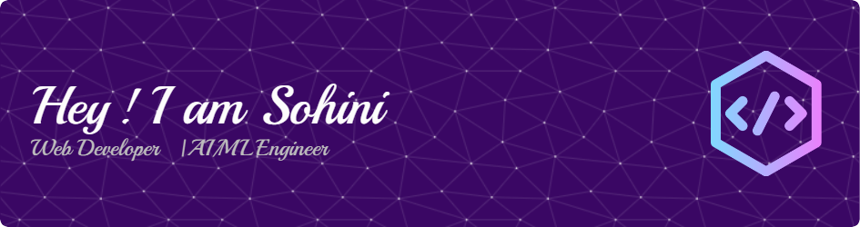

 

###

 

<h4 align="left">-👩‍🎓 Studying BTech CSE -👩🏻‍💻 Specializing in AI-ML Engineering  -🕸️ Worked in Web Development -🔐 Cybersecurity Enthusiast -🎧 Music == Life</h4>

###

 

  
  
  

###

 

  
  
  
  
  
  
  
  
  
  
  
  
  
  
  
  
  
  
  
  
  
  
  
  
  
  
  
  
  
  
  
  
  
  
  
  
  
  
  
  
  
  
  
  
  
  
  
  
  
  
  
  
  
  
  
  
  
  
  
  
  
  
  

###

 

  
  
  
  
  
  

###

 

###
